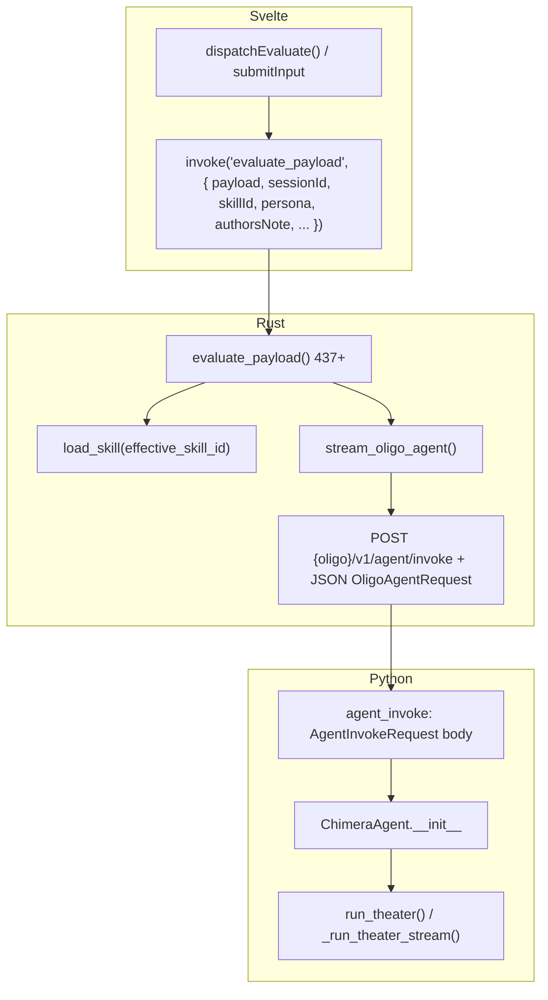

# 前后端契约全景扫描：术前系统状态报告 (CT)

> **范围**: `crucible_core/` (Python Oligo + `schemas`) 与 `astrocyte/` (Svelte + Tauri)  
> **目的**: 为 Schema 修改、数据流与多 LLM Client 等高风险重构提供基线。  
> **行号**: 以文档生成时仓库快照为准，若后续改动以实际文件为准。

---

## 维度 1: 前后端数据契约 (The Contract Layer)

### 1.1 Pydantic Schema 定义

以下列出 **在 Oligo HTTP 边界与 Agent 中实际参与、且与 Astrocyte 对 Python 的 JSON 最相关** 的模型。`schemas.py` 中尚有 Paper / Optics / Batch 等模型，**不经由当前 Astrocyte → Oligo 主链路**，此处仅作索引说明。

| 模型 | 用途 | 位置 |
|------|------|------|
| `ChatMessage` | Oligo 请求中 `messages` 元素 | `schemas.py` |
| `AgentInvokeRequest` | `POST /v1/agent/invoke` 的 body | `schemas.py` |
| `OligoAgentConfig` | Agent 行为（工具超时、Wash 规则）| `schemas.py`；由 Python `get_config().oligo_agent` 提供，**非 HTTP body 字段** |
| `PlannedToolCall` / `ExecutedToolResult` / `ToolCallStatus` | Agent 内部与工具执行，**不跨 Rust↔Oligo HTTP** | `schemas.py` |

#### `ChatMessage`

| 字段 | 类型 | 必填 | 默认 | `description`（节选） |
|------|------|------|------|------------------------|
| `role` | `Literal["system","user","assistant","tool"]` | 是 | — | The author of this message. |
| `content` | `str` | 是 | — | The textual content of the message. |
| `tool_call_id` | `str \| None` | 否 | `None` | OpenAI tool result 预留 |
| `name` | `str \| None` | 否 | `None` | 工具名预留 |

- `model_config = ConfigDict(extra="forbid")`  
- 见: ```273:286:d:\MAS\crucible_core\src\crucible\core\schemas.py```

#### `AgentInvokeRequest`（JSON：`Rust` → Oligo，对应 FastAPI 解析为 `body: AgentInvokeRequest`）

| 字段 | 类型 | 必填 | 默认 | `description`（要点） |
|------|------|------|------|------------------------|
| `api_key` | `str` | 是 | — | 网关/上游 LLM key（可空串若服务端有默认） |
| `base_url` | `str` | 是 | — | Chat completions API 根 |
| `model_name` | `str` | 是 | — | 模型 id |
| `persona_id` | `str \| None` | 否 | `None` | 仅日志，不参与路由 |
| `system_core` | `str` | 是 | — | L1 基线（如 active persona 的 `system_prompt` 本身） |
| `skill_override` | `str \| None` | 否 | `None` | 技能覆写（无 Field description） |
| `allowed_tools` | `list[str] \| None` | 否 | `None` | 白名单；`None` = 不限制 |
| `messages` | `list[ChatMessage]` | 是 | — | 无预拼的 gateway system |
| `persona` | `str \| None` | 否 | `None` | L2，Final 阶段 `[PERSONA OVERRIDE]` |
| `authors_note` | `str \| None` | 否 | `None` | L3，最后 `[AUTHOR'S NOTE]` |

- 见: ```290:326:d:\MAS\crucible_core\src\crucible\core\schemas.py```

#### 未在 `AgentInvokeRequest` 中、但相关的 Python 单例/配置

- `ChimeraConfig` / `get_config()` 提供 Oligo 监听、vault、`oligo_agent: OligoAgentConfig` 等；由 `server.py` **lifespan** 注入 `app.state`，**不随每次 invoke JSON 变化**（除非多 worker 重载配置）。

---

### 1.2 Rust 端对应结构

#### `OligoAgentRequest`（**仅 `Serialize`，用于 HTTP POST 至 Python**）

| 字段 | Rust 类型 | 备注 |
|------|-----------|------|
| `api_key` | `String` | 必填，总是序列化 |
| `base_url` | `String` | 必填 |
| `model_name` | `String` | 必填 |
| `persona_id` | `Option<String>` | `#[serde(skip_serializing_if = "Option::is_none")]` |
| `system_core` | `String` | 必填 |
| `skill_override` | `Option<String>` | `skip_serializing_if` |
| `allowed_tools` | `Option<Vec<String>>` | `skip_serializing_if` |
| `persona` | `Option<String>` | `skip_serializing_if` |
| `authors_note` | `Option<String>` | `skip_serializing_if` |
| `messages` | `Vec<OligoMessage>` | 必填 |

- `OligoMessage`：`{ role: String, content: String }`（无 `tool_call_id` / `name`；与 Pydantic `ChatMessage` 的 OpenAI 扩展字段不发送）
- 见: ```29:52:d:\MAS\astrocyte\src-tauri\src\llm_client.rs```

#### `Message`（Tauri 内部会话、非 Oligo 边界）

| 字段 | 类型 | serde |
|------|------|--------|
| `role` | `String` | `Serialize, Deserialize`（`state.rs`） |
| `content` | `String` | 同上 |

- 见: ```11:15:d:\MAS\astrocyte\src-tauri\src\state.rs```

#### `SkillDefinition`（来自 `~/.chimera/skills/*.json`，**非** Oligo JSON 的顶层结构体）

| 字段 | 类型 | serde |
|------|------|--------|
| `id` | `String` | 默认 |
| `name` | `String` | 默认 |
| `system_override` | `String` | 默认 |
| `allowed_tools` | `Option<Vec<String>>` | `#[serde(default)]` |

- 见: ```9:16:d:\MAS\astrocyte\src-tauri\src\skills.rs```

#### `PersonaConfig`（Persona 存储；**不** 等同于 HTTP `AgentInvokeRequest`）

| 字段 | 类型 |
|------|------|
| `id` | `String` |
| `name` | `String` |
| `system_prompt` | `String` |
| `authors_note` | `Option<String>` |

- 见: ```6:11:d:\MAS\astrocyte\src-tauri\src\persona.rs```

#### `ProviderConfig` / `AstrocyteConfig`（`provider_config.json`）

- `ProviderConfig`: `id, name, api_key, base_url, model_name`（```31:38:d:\MAS\astrocyte\src-tauri\src\settings.rs```）
- `AstrocyteConfig`: `active_provider_id`, `providers`, `is_oligo_mode`, `active_skill_id`, `oligo_base_url`（```73:84```）

---

### 1.3 契约一致性检查

| 检查项 | 结论 |
|--------|------|
| **Rust `OligoAgentRequest` 与 Pydantic `AgentInvokeRequest` 顶层字段** | **一一对应**：`api_key`, `base_url`, `model_name`, `persona_id`, `system_core`, `skill_override`, `allowed_tools`, `persona`, `authors_note`, `messages`。 |
| **Python 有、Rust Oligo 无** | Pydantic `ChatMessage` 的 `tool_call_id` / `name`：当前 **Rust 不发送**；Oligo 若仅产生 user/assistant 对话则通常为 **兼容（缺省为 null）**。 |
| **Rust 有、Python 无** | 无（顶层一致）。`OligoMessage` 是 **子集** 表示，非额外字段。 |
| **键名** | HTTP JSON 使用 **snake_case**（`serde` 默认 + Rust 字段名），与 Pydantic 字段名一致。 |
| **Tauri `invoke` ↔ Rust 命令** | 前端对 `evaluate_payload` 常使用 **camelCase**（如 `sessionId`, `persona` 在部分调用中与 Rust `session_id` 并存问题）：**Tauri 2 对 command 参数的反序列化规则需以官方文档/运行时行为为准**；若需 100% 确定，**建议人工在 DevTools/日志中打一次 `invoke` 载荷**。**未**在本文档中从源码钉死 Tauri 宏生成的 serde 重命名。 |

**结论（HTTP 段）**: Rust 发往 `POST {oligo}/v1/agent/invoke` 的 JSON 与 `AgentInvokeRequest` **字段名与语义对齐**；`messages` 中仅有 `role`/`content` 时与 `ChatMessage` 最小集一致。

---

## 维度 2: 数据流动路径 (The Data Flow)

### 2.1 一次用户发送的完整链路（Oligo 模式）

以下以用户向输入框提交 **「帮我分析 MemGPT」** 为例，且 **`is_oligo_mode == true`**。



| 阶段 | 位置 | 行为（摘要） |
|------|------|----------------|
| 1 | `+page.svelte` | `dispatchEvaluate` 在 ```946:1003:d:\MAS\astrocyte\src\routes\+page.svelte```：`invoke('evaluate_payload', { payload: normalized, sessionId, userMessageId, assistantMessageId, skillId, persona, authorsNote })` |
| 2 | `lib.rs` `evaluate_payload` | ```437-681```：取 `active_persona`、`config`；`effective_skill_id = skill_id ?? config.active_skill_id`；`system_core = active_persona.system_prompt`；`session_note` 与 `active_persona.authors_note` 合并为 `effective_authors_note`；`skills::load_skill` → `skill_override` + `allowed_tools`；`build_oligo_transcript_messages` 仅 user/assistant + 本回合 user。 |
| 3 | `llm_client.rs` | `stream_oligo_agent` ```168-208```：`build_oligo_invoke_url` → `{trim}/v1/agent/invoke`（```64-69```）；`body = OligoAgentRequest { ... }`；`Client::post().json(&body).eventsource()`。 |
| 4 | `server.py` | ```80-104```：`@app.post("/v1/agent/invoke")`；`body: AgentInvokeRequest`；`build_openai_client_from_params(api_key, base_url, model_name, default_settings=settings)`；`ChimeraAgent(..., persona=body.persona, authors_note=body.authors_note)`。 |
| 5 | `agent.py` | `__init__` ```200-253```：保存 `_system_core`, `_persona`, `_authors_note`, `_skill_override`, `allowed_tools`；`messages[0]` 为 **Router** system = `_ROUTER_SYSTEM_PROMPT` + 可选 skill 段；`run_theater` → `_run_theater_stream` 探针/CMD/工具/最终流。 |

**Skill 加载**: `evaluate_payload` 中 ```506-521```，`effective_skill_id` 经 `skills::load_skill` 读 `~/.chimera/skills/{id}.json`（见 `skills.rs` ```31-35```）。

**直连模式分支**: 同文件 ```586-608``` 使用 `stream_direct_api`，**不** 调用 Oligo；`build_direct_mode_messages` 与 `compose_prompt_injection_system` 对齐三层注入（```404-432, 704-```）。

### 2.2 配置流动路径

| 层 | 路径 / API | 说明 |
|----|------------|------|
| 共享 TOML | `~/.chimera/config.toml` | **Python** `get_config_path()` → `get_chimera_root()/config.toml`（```50-52:d:\MAS\crucible_core\src\crucible\core\platform.py```）；**Rust** `config::load_config()` 同一路径（```115-119:d:\MAS\astrocyte\src-tauri\src\config.rs```）。 |
| Python 单例 | `get_config() -> ChimeraConfig` | `ChimeraConfig` 为 Pydantic `BaseSettings` + 自定义 TOML/legacy 源（```214-263:d:\MAS\crucible_core\src\crucible\core\config.py```）。**不是** `ChimeraConfig.load()` 类方法；`load_config()` 为 **deprecated 别名** 指向 `get_config()`（见 `config.py` 中 `load_config` 定义）。 |
| Oligo 启动 | `server.py` `lifespan` | `settings = get_config()` 注入 `app.state.settings`；`VaultReadAdapter(settings)` 等（```28-40:d:\MAS\crucible_core\src\oligo\api\server.py```）。 |
| Astrocyte TOML | `main.rs` / `lib.rs` `run()` | `config::load_config()`；失败用 `ChimeraConfig::default()`（```1050-1059, 1062-1063:d:\MAS\astrocyte\src-tauri\src\lib.rs```）；`ChimeraConfig` 在 `state::AstrocyteState::new(chimera)` 中 **只读**（```32-40:d:\MAS\astrocyte\src-tauri\src\state.rs```）。 |
| Astrocyte Provider JSON | `~/.chimera/provider_config.json` | `load_astrocyte_config` / `save_astrocyte_config`（```134-156:d:\MAS\astrocyte\src-tauri\src\settings.rs```）；`RwLock` 于 `state.config`。 |
| Oligo Base URL 优先级 | `settings::effective_oligo_base_url` | 环境变量 `OLIGO_BASE_URL` > `config.toml` 的 `[oligo]` 推导 URL > `provider_config.json` 中 `oligo_base_url`（与 TOML 冲突时的分支逻辑，```16-28:d:\MAS\astrocyte\src-tauri\src\settings.rs```）。 |

**注意**: `AstrocyteConfig`（JSON）与 `ChimeraConfig`（TOML 子集由 Rust 反序列化）是 **两套** 结构；Oligo 口地址以 **TOML + 环境变量 + 上述函数** 合成，不经过 Python 的 `get_config()` 在 Rust 端。

---

## 维度 3: Oligo 工作流 (The Agent Lifecycle)

### 3.1 请求生命周期

#### Phase 0: 初始化

- `ChimeraAgent` 在 `server.py` 中实例化，参数来自 `AgentInvokeRequest`（见上一节表）。
- `llm_client`: `build_openai_client_from_params` 产生的 OpenAI 兼容客户端（**非** 字面量 `llm_client.py` 文件名；实现于 `openai_compatible_client`）。
- `wash_client`: `app.state.wash_client`（```97-98:d:\MAS\crucible_core\src\oligo\api\server.py```）。
- `vault`: `VaultReadAdapter(settings)`（```40, 99```）。
- `skill_override` / `allowed_tools`: 存于 `self._skill_override`、`self.allowed_tools`；Router 用 `_skill_override` 拼在 `_ROUTER_SYSTEM_PROMPT` 后（```242-248:d:\MAS\crucible_core\src\oligo\core\agent.py```）。
- `llm` 在构造里标注为 `Any`（**类型债**，见维度 5）。

#### Phase 1: Router

- `_ROUTER_SYSTEM_PROMPT` 全文：```88-100:d:\MAS\crucible_core\src\oligo\core\agent.py```（Chimera router + `<CMD:...>` / `<PASS>` 规则）。
- `skill_override` 注入：同上 ```242-248```，块标题 `"[USER SKILL DIRECTIVE (FOLLOW THIS FOR YOUR REASONING)]:"`。
- 输出：非流式 `generate_raw_text` 探针；用 `CMD_REGEX` 解析：```77```  
  `r"<CMD:([a-zA-Z0-9_]+)\((.*?)\)>"` , `re.DOTALL`；解析逻辑 ```284-321```。

#### Phase 2: Tool 执行

- 解析：同上 `CMD_REGEX` 与 `_parse_tool_calls`。
- `allowed_tools`：`None` 则全部 `allowed=True`；否则仅列表内为 True（```300-310```）。
- 执行与超时：`_execute_tool` 经 `_run_single_tool_call` 用 `asyncio.wait_for` 包一层（`wait_for` 在 ```375-382``` 一带，以 `tool_execution_deadline_seconds` 为界）。
- Wash：`_wash_tool_results` / `_wash_tool_result`（```530-634``` 等）；`bypass_wash_tools` / `force_wash_tools` 与 `wash_min_chars` 来自 `OligoAgentConfig`（Pydantic 默认见 `schemas.py` ```400-431```）。

#### Phase 3: Final Stream

- `_final_persona_system_content`：```255-277:d:\MAS\crucible_core\src\oligo\core\agent.py```：L1 = `system_core` + 可选 `skill_override` 合成块；L2 = `[PERSONA OVERRIDE]`（若与 `system_core` 去重后仍有差异）；L3 = `[AUTHOR'S NOTE]`。
- 注入位置：`final_system = ChatMessage(role="system", content=...)`，放在 **最终** `messages` 的顶端，其后为原对话去掉首条 router system 的副本（```777-781```，逻辑见上文 775-782 行左右）。
- SSE：`run_theater` 内最终阶段对输出做分块 `yield _sse_chunk`（见 ```816-819```）；工具阶段用 `_sse_data` 与 `__SYS_TOOL_CALL__` 前缀；结束发 `bb-stream-done` 等于多种路径（超时/错误/abort 等）。

### 3.2 关键决策点

| 条件 | 行为 |
|------|------|
| `skill_override is None` | Router 仅 `_ROUTER_SYSTEM_PROMPT`；Final 的 L1 仅 `system_core`（```261-266```）。 |
| `allowed_tools is None` | 所有解析到的工具在规划中 `allowed=True`（```300-302```）。 |
| 工具 `asyncio.wait_for` 超时 | 返回带 `ToolCallStatus.TIMEOUT` 等结果路径（需结合 `_run_single_tool_call` 全文；摘要：超时记入 executed result）。**需对照** `_run_single_tool_call` 完整实现以写事故复盘。 |
| **Final** 流 `asyncio.wait_for` 超时（120s） | 发出 `sse_event("bb-stream-done", {"error": True, "message": "LLM gateway timeout"})`（```799-807```）。 |
| Wash LLM 失败 | `_wash_tool_result` 内对异常有 fallback/截断逻辑（以 ```530+``` 为准）；概括：**尽量返回可用字符串，不使整个 theater 无提示退出**（具体分支见同文件） |
| 客户端断连 | `CLIENT_GONE_EXCEPTIONS`；`run_theater` 最外层发 `bb-stream-done` `aborted`（```832-850```） |

---

## 维度 4: 前端 UI 的当前状态 (The Interface Layer)

### 4.1 关键组件

| 功能 | 文件 | 说明 |
|------|------|------|
| 主聊天、输入、Oligo 选择器 | `astrocyte/src/routes/+page.svelte` | 单页包含 HUD、时间线、设置遮罩、Persona/Skill/Note 等 |
| Provider 配置 | 同上，Settings 子区域 | 与 `settingsTab === 'provider'` 分支绑定 |
| Skill 选择 | 同上 | `#skill-quick-select`，`activeSkillId` |
| Persona 选择 | 同上 | `#persona-quick-select`，`onPersonaQuickSelect` / `set_active_persona` |
| 会话级 Author’s Note 输入 | 同上 | `#session-authors-note`，`authorsNoteInput` |
| 全局 CSS | `astrocyte/src/app.css` | `.hud-input-wrap`、`.persona-quick-select` 等 |

**无** 独立 Svelte 子组件文件拆分上述选择器；均在 `+page.svelte`。

### 4.2 UI 状态管理（摘要）

| 配置/状态 | 存储 | 读取 | 更新 |
|------------|------|------|------|
| Provider 列表与 active | **Rust 文件** `~/.chimera/provider_config.json`（`AstrocyteState.config`） | `invoke('get_config')` onMount 等 | `save_provider` / `set_active_provider` / `delete_provider` |
| Oligo 模式 | 同上 | `get_config` | `set_is_oligo_mode` |
| Active skill id | 同上 + 内存 `activeSkillId` | `get_config` 与本地 `activeSkillId` 同步 | `onSkillSelect` / `set_active_skill_id` |
| Persona 列表与 active | **Rust 文件** `~/.chimera/chimera_personas.json` | `get_personas` | `save_persona` / `set_active_persona` / `delete_persona` |
| 聊天历史（会话） | **Rust 内存** `AstrocyteState.sessions` + 可选 `memory` 持久化（见 `lib.rs` `sync_session_history` 等） | `get_session_history` 等 | 发送/编辑/删消息时 `invoke` |
| 会话 `authorsNoteInput` | **仅 Svelte 内存** | 组件 `let authorsNoteInput` | 用户输入绑定 |

**localStorage**: 对 `astrocyte/` 全库 `grep localStorage` **无匹配**；Provider/Persona 等以 `~/.chimera/*.json` + Tauri 状态为准。

### 4.3 HTML / CSS

- Provider / Skill / Persona：原生 **`<select>`** 与 **`<input type="text">`**（Note）。
- 关键类名：`hud-input-wrap`, `persona-quick-switch`, `persona-quick-select`, `session-authors-note-input`（`app.css` 与行内 `class`）。
- **无** 在 `package.json` 层面识别到 shadcn/Material 等重型 UI 库用于这些控件；**需要人工确认** 是否其他路由引入不同 UI 框架。

---

## 维度 5: 痛点与技术债 (The Known Issues)

### 5.1 TODO / FIXME / HACK

- **Oligo / astrocyte 与本次读取路径下 grep 未命中** 上述关键字（**不代表** 全仓无 TODO；仅本次扫描范围）。

### 5.2 类型与宽松写法

| 位置 | 说明 |
|------|------|
| `agent.py` `llm_client: Any` | ```17, 205``` 等：LLM 客户端不静态约束协议 |
| `+page.svelte` `token: any` | ```181```：`marked` renderer 的 code 回调 |
| Python `ClientDisconnect` 等 | `type: ignore[attr-defined]`（```49```） |
| 其他 `Any` / `@ts-ignore` | **全仓** 未在审计中系统枚举；**建议** `rg "Any"`, `rg "@ts"` 在 CI 中补全 |

### 5.3 硬编码与魔法数（节选）

| 项 | 值/位置 | 说明 |
|----|---------|------|
| Oligo 默认 host/port (Rust) | `127.0.0.1:33333` | `config.rs` `default_oligo_*` |
| Final 分块与 sleep | `chunk_size=3`, `0.04` 秒 | `agent.py` ```816-819``` |
| Theater 外圈超时 | `_THEATER_LLM_OUTER_TIMEOUT_S = 120.0` | ```79``` |
| Router CMD 行截断 | `8000` 等 | 工具回写 assistant 时 |
| Wash fallback 字符 | `_WASH_FALLBACK_CHARS` 等 | ```80-85``` |
| 默认 Tauri `RUST_LOG` | `debug` | `main.rs` ```5-8``` |
| 全局占位 `session` | `normalize_session_id` 中 `default_session` | `lib.rs` 当 `session_id` 空时 |

`platform.rs` 所管路径与 `~/.chimera` 一致时，不重复列「数据目录」为债，仅作 **单一事实源**。

---

## 维度 6: 依赖关系图 (The Dependency Graph)

### 6.1 Python（Oligo 关键子图）

```text
oligo/api/server.py
  ├─ crucible.bootstrap (build_openai_client_from_params, build_wash_client, …)
  ├─ crucible.core.schemas (AgentInvokeRequest)
  └─ oligo.core.agent (ChimeraAgent, CLIENT_GONE_EXCEPTIONS)

oligo/core/agent.py
  ├─ crucible.core.schemas (ChatMessage, OligoAgentConfig, PlannedToolCall, ExecutedToolResult, ToolCallStatus)
  ├─ crucible.ports.llm.openai_compatible_client (OpenAICompatibleClient)
  ├─ crucible.ports.vault.vault_read_adapter (VaultReadAdapter)
  ├─ oligo.core.sse (sse_event)
  └─ oligo.tools (TOOL_REGISTRY)
```

- **无** `agent.py` → `server.py` 的 import（单向）。

### 6.2 Rust（Astrocyte）

```text
lib.rs
  ├─ llm_client
  ├─ skills
  ├─ settings (AstrocyteConfig, effective_oligo_base_url)
  ├─ config (ChimeraConfig, load_config)
  ├─ state
  ├─ persona
  ├─ memory
  └─ (commands 聚合)
```

- `llm_client.rs` 仅依赖 `settings::ProviderConfig`、`state::Message`，**不** import `lib.rs`。

### 6.3 循环依赖

- 在当前 **梳理的模块边界** 下，**未见** `lib.rs` ↔ `llm_client` 或 `server.py` ↔ `agent.py` 的环。
- **Python 包内** 若 `crucible` 子模块间存在环，需用 `pylint`/import graph **二次确认**（**未**在本审计中跑静态环检测命令）。

---

## 附录: 与即将进行的重构的映射

| 计划项 | 本报告中的锚点 |
|--------|----------------|
| `persona` / `authors_note` 在 `AgentInvokeRequest` | 维度 1.1 表、1.3；维度 2.1 Phase 2–5；维度 3.1 Final |
| 前端 UI 重排 | 维度 4 |
| 多 LLM（working / wash / router）| Python `ChimeraConfig` 的 `llm` / `wash` 段 + `bootstrap`；Oligo 当前在 `server` 中 **每请求** `build_openai_client_from_params` 使用 body 的 key/url/model；**wash** 已单独 `wash_client`（lifespan） |

---

## 需人工确认项（汇总）

1. Tauri `invoke` 的 **camelCase** 与 Rust 命令 **snake_case** 的精确映射与失败表现。  
2. `localStorage` 或其它非文件持久化在 **全** 前端的用法。  
3. Python `get_config` 的 legacy YAML 回退与 **实际部署** 是否仍依赖。  
4. 全仓 `TODO` / `Any` / `@ts-ignore` 的完整清单与优先级。  
5. 工具超时时 `ExecutedToolResult` 的**每一**字段落库/展示路径。

---
*本报告为静态代码审查产物，不替代运行测试与 E2E 录屏证据。*
