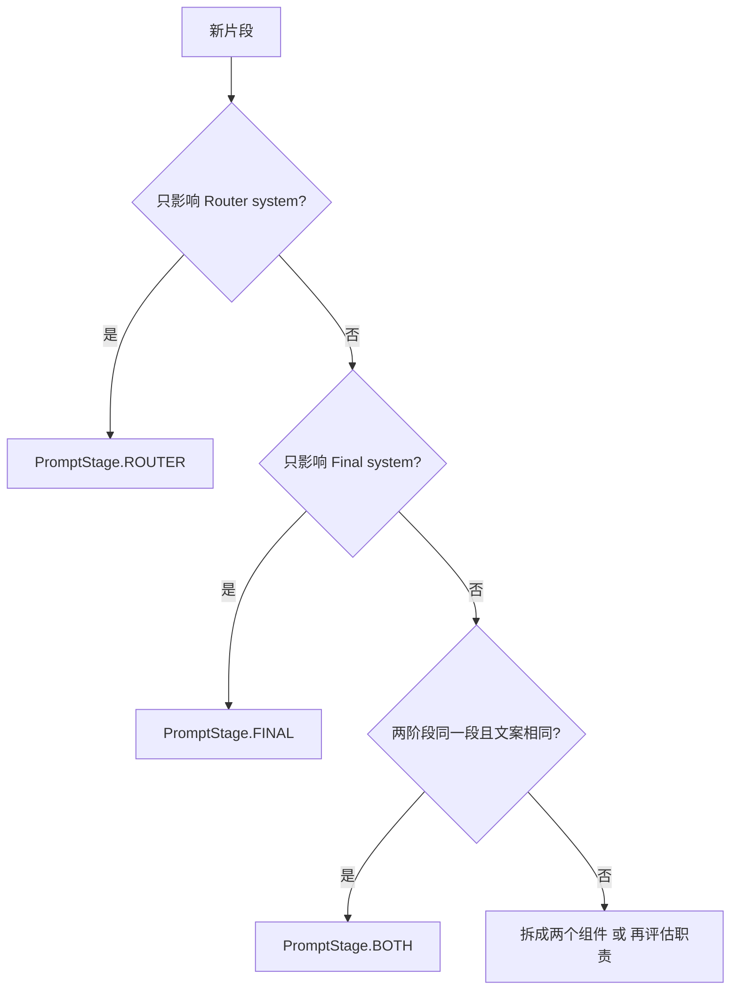

# Prompt 中间件规范（MW.4）

本文档描述 Oligo 中 `PromptComposer`、`PromptComponent` 的约定，及其与 `ChimeraAgent`、文本清洗（`TextSanitizer`）的契约。实现见 `src/oligo/core/prompt_composer.py`、`src/oligo/core/agent.py`。

---

## 1. 设计原则

### 1.1 为什么需要 PromptComposer

MW.0 审计中，路由 System 与最终 System 的拼接存在以下问题：

- **逻辑分散**：Router / Final 的文案、顺序、条件注入散落在 `agent` 各处，难以一眼看出「何时出现哪一段」。
- **重复与漂移**：同一约束（如 meta 说明、禁止伪 `<CMD>`）在多处手写，版本间易不一致。
- **可测试性差**：难以对「仅 stable 部分」做字节级回归，也无法单独描述某一片段是否参与 prefix cache。

`PromptComposer` 将片段显式建模为 `PromptComponent`，集中注册、按 `priority` 排序、统一 `compose`，使条件注入与缓存友好结构可文档化、可单测。

### 1.2 stable / dynamic 分离

`compose()` 返回 `(stable_section, dynamic_section)`：

- **stable**：由 `cacheable=True` 的组件经 `str.format(**context)` 渲染后，按 `priority` 降序用 `"\n\n"` 拼接。在 **context 中仅动态键（如 `timestamp`）变化** 时，若业务上仍把这些键放在 **非 cacheable** 组件中，则 stable 部分在多次请求间**字节级可复用**，便于 **KV / prefix cache**（各厂商名称不同：Anthropic 称 prompt cache、部分 OpenAI 兼容层称 prefix 缓存）命中。
- **dynamic**：`cacheable=False` 的组件渲染结果（如 `dynamic_timestamp`），与 stable 用 `"\n\n"` 接成完整 System 时，agent 使用 `f"{stable}\n\n{dynamic}".strip()`（见 `ChimeraAgent._build_router_system_prompt` / `_final_persona_system_content`）。

**注意**：`cacheable` 是**结构意图**的声明；是否真正走底层 prefix cache 取决于 `LLMClient` 对「稳定前缀 + 可变差 suffix」的利用程度（见 [6. 已知未解决问题](#6-已知未解决问题)）。

### 1.3 `cacheable` 标志语义

| 值 | 含义 |
|----|------|
| `True` | 本组件渲染结果视为 **stable 前缀**的一部分，应尽量使用「随会话缓慢变化或不变」的 context 键。 |
| `False` | 本组件为 **per-request 或强动态** 内容（如 `timestamp`），从 stable 中剥离，避免污染可缓存 prefix。 |

---

## 2. `PromptComponent` 字段语义

### 2.1 `id` 命名规范

- 使用 **`{stage_prefix}_{role}`** 或 **`{stage_prefix}_{content}`** 的蛇形名，与 `PromptStage` 含义一致，避免歧义。
- 示例：`router_core`、`router_tool_registry`、`final_guardrail`、`dynamic_timestamp`。
- **禁止** 与 `PromptComposer._register_default_components` 中已有 id 重复；新增前全文搜索 `register(` 与 `active_ids` 中的字符串。

### 2.2 `priority` 区段约定

| 区段 | 典型用途 |
|------|----------|
| **90–100** | 核心规则、路由/人设基座，**不可被后段覆盖**（排序靠前，后段不「覆盖」前段，但排序靠后片段可对模型呈更晚的上下文，故核心须保持高 priority）。 |
| **50–80** | 任务约束、Skill、与路由强相关的指令性片段。 |
| **10–40** | 用户级调整、Persona 覆盖、author's note 等。 |
| **1–10** | **Guardrail** 与**尾段元数据**：`final_guardrail` 使用 **10**（仍低于 persona 60 / skill 80，在排序上先于时间戳段）；`dynamic_timestamp` 使用 **5**（per-request 时间）。 |

> 同一段内多组件时，**数字越大越靠前**（`compose` 中 `sort(..., reverse=True)`）。

### 2.3 `stage` 选择决策树



- `PromptStage.MESSAGE_INJECTION`：非当前默认注册路径；仅当需注入**非 system** 消息体时使用（见 `PromptComposer._component_matches_stage` 的扩展点）。

### 2.4 `renderer` 与 `template` 形态（IR.4）

`PromptComponent` 除 `text` 外支持 `renderer="xml_structured"`：`template` 须为 **可嵌套 dict**，由 `PromptComposer` 用 `xml.etree.ElementTree` 序列化为一段 XML 字符串后再参与 stable/dynamic 拼接（**仅注入 prompt**，不用于解析 LLM 输出）。

字段定义与校验（`template` 与 `renderer` 必须一致）：

```537:572:src/crucible/core/schemas.py
PromptRenderer = Literal["text", "xml_structured"]


class PromptComponent(BaseModel):
    ...
    renderer: PromptRenderer = Field(
        default="text",
        description="text: template 为 str，经 str.format(context)；xml_structured: template 为 dict，经 ElementTree 序列化注入（仅 prompt，不用于解析 LLM 输出）。",
    )
    template: str | dict[str, Any] = Field(
        description="text 模式为含占位符的字符串；xml_structured 模式为可嵌套的 dict（由 PromptComposer 序列化为 XML）。",
    )

    @model_validator(mode="after")
    def _renderer_matches_template_kind(self) -> PromptComponent:
        if self.renderer == "xml_structured":
            if not isinstance(self.template, dict):
                raise ValueError(
                    "renderer 'xml_structured' requires template to be a dict[str, Any]"
                )
        elif not isinstance(self.template, str):
            raise ValueError("renderer 'text' requires template to be a str")
        return self
```

`compose` 分支：`text` 走 `str.format(**context)`；`xml_structured` 走 `_render_xml_structured`（根元素名为 `structured`，子树由 dict 键值递归生成）：

```230:236:src/oligo/core/prompt_composer.py
def _render_xml_structured(data: dict[str, Any]) -> str:
    """将嵌套 dict / list / 标量转为带缩进的 XML 字符串（ElementTree；仅用于 prompt 注入）。"""
    root = ET.Element("structured")
    for k, v in data.items():
        _xml_append_value(root, k, v)
    ET.indent(root, space="  ")
    return ET.tostring(root, encoding="unicode")
```

```288:304:src/oligo/core/prompt_composer.py
        for c in candidates:
            if c.renderer == "xml_structured":
                if not isinstance(c.template, dict):
                    raise TypeError(
                        f"component {c.id!r}: xml_structured template must be dict"
                    )
                rendered = _render_xml_structured(c.template)
            else:
                if not isinstance(c.template, str):
                    raise TypeError(
                        f"component {c.id!r}: text renderer expects str template"
                    )
                rendered = c.template.format(**context)
            if c.cacheable:
                stable_parts.append(rendered)
            else:
                dynamic_parts.append(rendered)
```

**使用场景**：把结构化片段（演示检索摘要、配置树、键值表）塞进 Router/Final system，避免手写易错的 XML 字符串或大量 `{{` 转义。

**边界**：

- 不支持在 `xml_structured` 的 dict 里写 `str.format` 占位符；若需注入 `context` 中的标量，请拆成 `text` 组件或在外层用 `text` 包裹说明。
- 标签名由键名经 `_sanitize_xml_tag` 规范化；异常键名会被替换，不保证与原键完全同源字符级一致。
- **示例组件 `retrieval_context_demo`** 已注册为 `xml_structured`，但 **默认未列入** `_compute_active_router_components` 的 `active_ids`；若要启用须在 `ChimeraAgent._compute_active_router_components`（或等价扩展点）显式加入该 id（`364:380:src/oligo/core/prompt_composer.py`）。

---

## 3. 现行 component 清单

与 **MW.2 任务 1** 的组件表一一对应；注入条件以 **pseudo-code** 表示（与 `ChimeraAgent` 实现一致）。

| id | stage | priority | cacheable | 注入条件 (pseudo-code) | 模板占位符 / 说明 |
|----|--------|----------|------------|-------------------------|-------------------|
| `router_core` | ROUTER | 100 | 是 | `always` | 无；`ROUTER_INTRO` 常量。 |
| `router_tool_registry` | ROUTER | 90 | 是 | `always` | `{tool_list}`，拼 `ROUTER_POST_TOOLS`。工具列表由 **`ToolRegistry.list_specs()`**（经 `ChimeraAgent._build_tool_list_text` → `_render_tool_list`）按 `allowed_tools` 过滤生成；**verbose** 模式下 `long_running` 工具在标题行追加 **`[long_running → returns task_id; poll with the status tool from the same list]`**（见 `_format_one_tool_verbose`）。 |
| `router_skill_directive` | ROUTER | 80 | 是 | `if self._skill_override` | `{skill_override}`。 |
| `final_system_core` | FINAL | 100 | 是 | `always` | `{system_core}`。 |
| `final_skill_directive` | FINAL | 80 | 是 | `if self._skill_override` | `{skill_override}`。 |
| `final_persona_override` | FINAL | 60 | 是 | `if self._persona and self._persona.strip() != self._system_core.strip()` | `{persona}`。 |
| `final_authors_note` | FINAL | 40 | 是 | `if self._authors_note` | `{authors_note}`。 |
| `final_guardrail` | FINAL | 10 | 是 | `always` | 无；`FINAL_GUARDRAIL_TEXT`。 |
| `dynamic_timestamp` | BOTH | 5 | 否 | `always` | `{timestamp}`，一般为 `datetime.now().isoformat()`。 |
| `retrieval_context_demo` | ROUTER | 15 | 是 | **默认关闭**（未加入 Router `active_ids`） | `renderer=xml_structured`，`template` 为演示用 dict；启用方式见 [§2.4](#24-renderer-与-template-形态ir4)。 |

> Router 的 `active_ids` 不含 persona / author；仅 `_compute_active_router_components` 与上表一致（外加未默认启用的 `retrieval_context_demo`）。Final 为 `_compute_active_final_components`。

---

## 4. 新增 component 的 checklist

1. **选 `id`**：在仓库中搜索，避免与现有 id、测试中的字符串冲突。
2. **选 `stage` / `priority` / `cacheable`**：对照 [2. PromptComponent 字段](#2-promptcomponent-字段语义) 与 [3. 组件清单表](#3-现行-component-清单)。需要每请求唯一值则 `cacheable=False`。
3. **写 `template`**：`renderer="text"` 时仅使用 `str.format` 支持的 `{name}`，字面量大括号写作 `{{` / `}}`（参见 `router_tool_registry` 与 `ROUTER_POST_TOOLS`）。`renderer="xml_structured"` 时为 **dict**，见 [§2.4](#24-renderer-与-template-形态ir4)。
4. 在 **`_register_default_components`** 中 `composer.register(PromptComponent(...))`。
5. 在 **`_compute_active_router_components`** 或 **`_compute_active_final_components`** 中加入条件；若新片段条件复杂，可抽小函数并加单测。
6. **更新本文档 [3. 现行 component 清单](#3-现行-component-清单)** 的表格，并在 MW.2 侧表格（若仍存在）保持同步；同步更新 `tests/oligo/test_prompt_middleware_regression.py` 中的 `MW4_COMBINED_PROMPT_BASELINE_BYTES`（若模板长度变化）。

---

## 5. 三层 Strip 调用契约

`TextSanitizer`（`src/oligo/core/text_sanitizer.py`）三层职责：

| 层 | 方法 | 作用摘要 |
|----|------|----------|
| **1** | `strip_reasoning_tags` | 去掉 `thinking` / `redacted_thinking` 等推理块与孤儿标签。 |
| **2** | `strip_tool_syntax_in_visible` | 在**非**围栏/行内代码区去掉 `<CMD>`、`<tool_call>`、`<PASS>` 等工具语法（内部可对代码区调用 `_strip_cmd_pass_toolcall_raw`）。 |
| **3** | `sanitize_messages_history` | 历史消息：去未配对 `tool` 行、对字符串 content 组合调用 2→1、可选 assistant 截断。 |

`strip_code_blocks_for_tool_matching` 用于 **CMD 正则从可见文本匹配前** 去掉代码块/行内反引号（见 `_parse_tool_calls` 路径），**不等价**于对外的「层 2 整段可见清洗」，但同属「别在错误区域执行」家族。

**位点（`ChimeraAgent`）**

| 位点 | 调用 | 层 |
|------|------|----|
| 送往 Router / Final / stream 的 **LLM 请求前** | `_apply_history_sanitizer_to_messages()` → `sanitize_messages_history` | **3**（内部按角色对内容执行 2 再 1） |
| 路由 `probe` 的 **回填空草稿** | `strip_tool_syntax_in_visible` | **2** |
| **Final 流式输出** 整段 `full_response` 在分块前 | `strip_tool_syntax_in_visible(strip_reasoning_tags(...))` | **1 后 2**（与历史 content 的 2→1 顺序不同，由流式边界需求决定，勿在外再叠一层 ad-hoc strip） |

**不要在中间件外**对同一 payload 再写一套与上述不等价的 strip，除非经评审并同步本文档与测试。

---

## 6. 已知未解决问题

1. **`cacheable` 目前仅为元数据**：`LLMClient` 尚未按 stable/dynamic 分段调用以利用厂商 **prefix / KV cache**；后续需在客户端层将「稳定前缀」与「动态 suffix」绑到实际 API 参数（若该路由支持）。
2. **多 `PromptComponent` 的 `{placeholder}` 冲突**未在注册或 `compose` 时做静态检测；若两模板使用同名的不同语义键，需人工排雷或未来加校验。

---

## 修订与同步

- 修改默认组件或 `active_ids` 逻辑时：更新本文件 [§3](#3-现行-component-清单)、`tests/oligo/test_prompt_middleware_regression.py` 中的基线/断言（若适用）。
- 意图识别、工具失败展示与「不自动 retry」边界见 `docs/INTENT_AND_DEGRADATION.md`。
